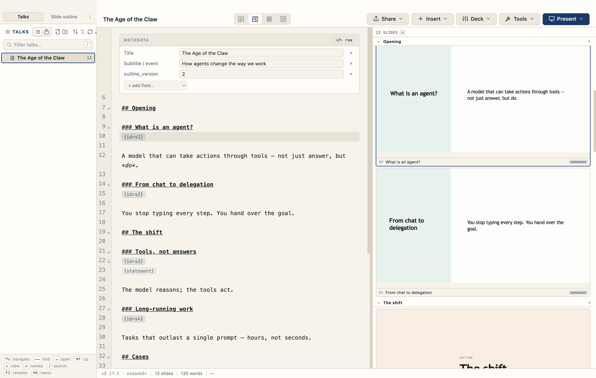

# TalkWeaver



A desktop app for **writing talks as plain-text outlines and presenting them as slides**. You
keep a folder ("vault") of Markdown outlines; TalkWeaver compiles each into a self-contained
HTML deck with a presenter view, and gives you a keyboard-first editor, a slide browser, and
tools for building alternate cuts of a talk without duplicating it.

It is a power-user tool built around one idea: **the outline is the source of truth, and
everything else is a view of it.**

> **Status:** early public release. It runs well on Apple Silicon macOS (where it is developed
> daily); the Windows build is provided best-effort and some macOS-only features are absent
> there (see [Platform support](#platform-support)).

## Features

- **Outline-first authoring** — every heading is a slide; write in Markdown, present in seconds.
- **Presenter view** — notes, a clock, and step-through, in a separate window from the audience.
- **Slide designs** — a registry of layouts (statements, two-column, image grids, container
  carousels, contents pages, and more), chosen with a keyboard picker or an inline `{ }` syntax.
- **Inspector** — pre-render any slide and tweak its options live (`⌘P`).
- **Pathways** — build a shorter or audience-specific cut of a talk by *ticking* slides; the
  outline never changes. View them as a Grid, a numbered List, or a cross-pathway Matrix.
- **Planned Runs & handouts** — schedule deliveries, attach recordings, and publish a per-Run
  handout, all from History.
- **Publishing** — optional one-click publish of a deck or handout to your own Cloudflare account.
- Full keyboard parity, a searchable command palette (`⌘⇧P`), and a `?` shortcut cheat-sheet.

## Install

### macOS (Apple Silicon)

1. Download `TalkWeaver-<version>-arm64.dmg` from the
   [latest release](https://github.com/techczech/talkweaver-app/releases/latest).
2. Open the DMG and drag TalkWeaver to Applications.
3. **First launch:** the build is not yet code-signed with an Apple Developer ID, so macOS
   Gatekeeper will refuse it. Clear the quarantine flag once, then open it:

   ```sh
   xattr -cr /Applications/TalkWeaver.app
   open /Applications/TalkWeaver.app
   ```

   (This is only needed until signed, notarized builds ship.)

### Windows

Download and run `TalkWeaver-Setup-<version>.exe` from the
[latest release](https://github.com/techczech/talkweaver-app/releases/latest). SmartScreen may warn
about an unrecognised publisher (the build is unsigned) — choose **More info → Run anyway**.

## First run

TalkWeaver asks you to pick a **vault** — any folder where your talks live. Each talk is a
sub-folder containing a `*-outline.md` file. Start a new talk from the app, or point it at a
folder you already have.

## Platform support

| Feature | macOS (Apple Silicon) | Windows |
| --- | --- | --- |
| Authoring, presenting, designs, Pathways, Runs | ✅ | ✅ |
| Slide-image OCR search | ✅ | ✗ (macOS Vision only) |
| Video/media probing | ✅ | ✗ (macOS only) |
| Local transcription | ✅ (bring your own Python engine) | ⚠ untested |
| Cloudflare publishing | ✅ | ✅ |

Intel Macs are not built yet.

## Build from source

Requires [Node.js](https://nodejs.org) 20+ and, for the macOS native helpers, the Swift
toolchain (Xcode command-line tools).

```sh
npm install
npm run dev            # run in development
npm test              # full test suite
npm run dist:mac:release   # build a macOS installer (.dmg + .zip) into release/
npm run dist:win:release   # build a Windows installer (.exe) — run on Windows
```

## Contributing

Issues and pull requests are welcome. The codebase favours small, test-anchored changes; run
`npm test` before opening a PR.

## Licence

[MIT](LICENSE) © 2026 Dominik Lukeš
