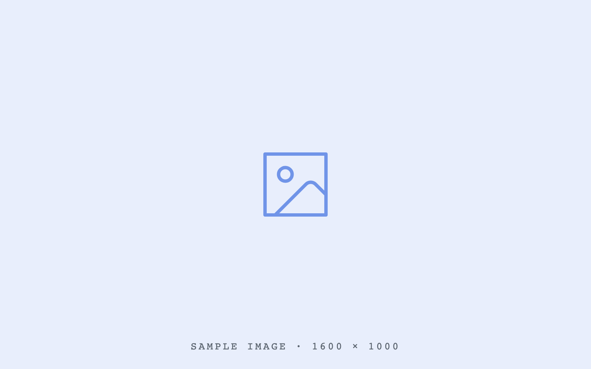

## Sample

### Reading on a phone {statement}

A slide is a composition. Scaling keeps it; reflowing replaces it.

### What the companion text must carry {list}{reveal}

- Structure survives the trip
  - Indents become indents
  - Bullets stay bullets
- Prose stays prose
  - A paragraph is not a bullet list
  - Nothing invents structure that the outline did not have
- Quotes read as quotes
- Media is named, not silently dropped

### On capability {quote}

> AI democratises capability. It does not democratise judgement.

— Dominik Lukeš

### Image beside copy {list}{image=left}

- Media slides still need a text companion
- The figure is named so nothing goes missing
- Captions carry the meaning the picture cannot

### Cognition versus tools {contrast}

- Judgement and knowledge :: Precision and exact retrieval
- Comparison and estimation :: Complex conditionals
- Recognising patterns :: Precise calculation

### The ChatGPT timeline {timelinedynamic}{reveal}

- 2022
  - ChatGPT released as a research preview
  - A research preview becomes a product overnight
- 2023
  - GPT-4, plugins and the first tools
  - Tool use turns a chat box into a worker
- 2024
  - Agents take multi-step work
  - Long-running tasks stop needing a human at every step

### Three roles of AI {table}

| Capability | Where it helps |
| --- | --- |
| Drafting | Getting past a blank page |
| Structuring | Turning notes into an argument |
| Checking | Catching what you stopped seeing |

### Where the week goes {chart}

- Deep work :: 40
- Meetings :: 35
- Admin :: 25
