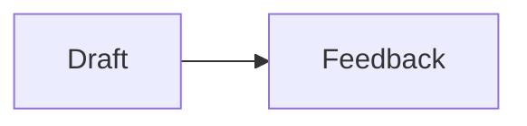

# TalkWeaver Layout Sampler

<!--
Purpose (ADR-0006): every registry layout exactly once + structural variations.
This Talk is the visual-regression fixture, the manual QA deck for design changes,
and the layout demo. A registry entry without a slide here fails the parity test.
Content is REAL (drawn from the "AI and Expertise" keynote the ADR-0005 mockups
were designed against) so the design can be judged on realistic slides.
Coverage hooks: each registry entry name must appear in the slide id/title or be
the slide's layout — keep the entry term in the heading for modifier/element slides.
Trigger syntax is compiler-validated: keep the **Timeline:** blocks, the
"A / B" contrast pairs, and the {role=section-title} divider exactly as shaped.
-->

## Everyday

### Nobody can change your brain for you
{statement}

### AI intern can help you draft your schedules and manage your calendar {reveal}

### Clear thinking matters {titletop}

### Statement default variant — current treatment
{statement=default}

The default statement remains an oversized claim with a centred block.

### Statement tint variant — panel and accent bar
{statement=tint}

The tint panel gives a claim **presence** without turning it into a quote.

### Statement poster variant — oversized boxed claim
{statement=poster}

One **boxed phrase** can carry the whole poster.

### The knowledge you need today
{list}

- How your computer works
- Principles of software architecture
- The developer-tools landscape
- How AI agents work
- What is possible with software

### The LLM is a universal translator (icon list)
{iconlist}

- language-to-language {icon=lucide:message-square}
- style-to-style {icon=lucide:pen-line}
- unstructured to structured {icon=lucide:boxes}
- text to code {icon=lucide:terminal}
- image to text {icon=lucide:image}
- question to answer {icon=lucide:message-circle-question-mark}
- problem-to-plan {icon=lucide:puzzle}

### Icon list boxes variant — hairline cards
{iconlist=boxes}

- Translate {icon=lucide:languages}
- Structure {icon=lucide:boxes}
- Build {icon=lucide:hammer}

### Icon list list variant — plain icon rows
{iconlist=list}

- Translate {icon=lucide:languages}
- Structure {icon=lucide:boxes}
- Build {icon=lucide:hammer}

### Icon list nested icons — every level (T28)
{icons=all}{id=t28-iconlist-nested}

- Chat answers questions
    - great for thinking out loud
    - you copy the results back yourself
- Codex changes the code
    - it acts in the repo and makes commits
    - you review the diff

### Icon list auto rule — three items keep boxes (T28)
{iconlist}{id=t28-iconlist-3}

- Translate {icon=lucide:languages}
- Structure {icon=lucide:boxes}
- Build {icon=lucide:hammer}

### Icon list auto rule — four items take rows (T28)
{iconlist}{id=t28-iconlist-4}

- Translate {icon=lucide:languages}
- Structure {icon=lucide:boxes}
- Build {icon=lucide:hammer}
- Ship {icon=lucide:rocket}

### Icon list boxes pinned on four items (T28)
{iconlist=boxes}{id=t28-iconlist-boxes-4}

- Translate {icon=lucide:languages}
- Structure {icon=lucide:boxes}
- Build {icon=lucide:hammer}
- Ship {icon=lucide:rocket}

### Background cobalt variant — readable cobalt tint
{bg=cobalt}

- The slide uses the cobalt tint
- The section accent remains independent

### Background emerald variant — readable emerald tint
{bg=emerald}

- The slide uses the emerald tint
- The section accent remains independent

### Background vermilion variant — readable vermilion tint
{bg=vermilion}

- The slide uses the vermilion tint
- The section accent remains independent

### Background forest variant — readable forest tint
{bg=forest}

- The slide uses the forest tint
- The section accent remains independent

### How to work with an agent (numbered)
{numbered}

- Describe the outcome, not the steps
- Give it the context a new colleague would need
- Let it work, then verify the result end to end
- Capture what you learned for the next run

### Quote
{quote}

> AI democratises **capability**. It does not democratise **judgment**.

- Alex LeBlanc, "AI amplifies expertise, not replaces it"

### Quote width — about 100 characters
{quote}{id=quote-width-100}

> A short quotation fills the one quote panel: the full content width and the shared display type, nothing else.

- Layout sampler, short quotation

### Quote width — about 220 characters
{quote}{id=quote-width-220}

> A somewhat longer quotation keeps exactly the same panel and the same type as the short one. When its sentences no longer fit the panel, the compiler splits it across slides instead of narrowing the type or widening the panel.

- Layout sampler, medium quotation

### Quote width — about 330 characters
{quote}{id=quote-width-330}

> A longer quotation still uses the same display type and the same width. More words become more slides, each part cut at a sentence boundary where one exists, so the audience always reads the panel at one size. The attribution stays inside the panel and appears on the last part only, in the same relationship to the quotation.

- Layout sampler, long quotation

### Quote width — about 600 characters
{quote}{id=quote-width-600}

> A substantially longer quotation is split across several slides at compile time. Every part renders the identical panel: the same width, the same display type, the same tint, accent rule and quotation mark. Parts before the last carry a small continuation mark at the bottom right of the panel, and the attribution renders once, on the final part. The split falls at sentence boundaries, then clause boundaries, then word boundaries, and never inside a bold or emphasised span. This fixture contains enough prose to require more than one continuation slide at the sixteen-hundred by nine-hundred stage.

- Layout sampler, very long quotation

### Quote width — about 900 characters
{quote}{id=quote-width-900}

> The longest sampler quotation exercises the splitter across many continuation slides. The compiler estimates the lines each part needs from the characters that fit one line of the panel at the shared type size, and from the lines the fit box between the slide margins and the footer band can hold. Each part must fit at both the sixteen-hundred by nine-hundred stage and the smaller twelve-eighty by seven-twenty stage, so the tighter of the two decides. At presentation time the runtime never widens the panel and never changes its type for a part that fits; only when real font metrics differ from the estimate does it step the type down towards the thirty-one pixel floor as a fallback, and it reports that fallback rather than hiding it. A quotation that still cannot fit one panel at the floor without breaking a protected span is the only case the compiler warns about as too long.

- Layout sampler, maximum quotation

### Real-deck quote — Stephen King
{quote}{id=quote-real-stephen-king}

> "I want to suggest that to write to your best abilities, it behooves you to construct your own toolbox and then build up enough muscle so you can carry it with you. Then, instead of looking at a hard job and getting discouraged, you will perhaps seize the correct tool and get immediately to work."

- Stephen King, On Writing

### Real-deck quote — Dean W. Ball
{quote}{id=quote-real-dean-ball}

> "By the end of this year, the least important thing you will be able to do with frontier AI systems will be getting chatbots to answer questions."

- Dean W. Ball, Among the Agents, 9 Jan 2026

### Contrast — cards variant
{contrast=cards}

- Complex algorithms / How your computer works
- Syntax of computer languages / Principles of software architecture
- Variables, functions, etc. / The developer-tools landscape
- How to use developer tools / How AI agents work

### What kind of judgment do you need (annotated)
{annotated}

- Fast judgment — recognising what something is, sensing a problem
- Slow judgment — backtracking through a problem step by step
- Taste — knowing which of two working answers is better
- Calibration — knowing when to trust the model and when to check

### Why are you studying at university (sidebar title)
{sidebar}

- Change your brain
- Change the world
- Prove to the authorities you can pass an exam

### Image
{media}


### Media row — video and image

[Video: https://example.com/media-row.mp4]


### Media row — measured 4:3 video and image
{id=media-row-measured-video}

[Video: ../e2e/fixtures/media-row-4x3.mp4]


### Media row — image, video and image


[Video: https://example.com/media-row.mp4]


### Media row — portrait and landscape


### Media gallery — four mixed media


[Video: https://example.com/media-row.mp4]

[Embed: https://example.com]


### Media slot — list, video and image
{id=media-slot-list-video-and-image}

- The video and image share the media column.
- The two figures remain stacked beside this list.

[Video: ../e2e/fixtures/media-row-4x3.mp4]


### Image beside copy — left
{list}{image=left}


- Copy stays vertically balanced beside the media slot

### Image beside copy — right
{list}{image=right}


- The registered media-placement option flips the slot

### Quiet layout title restored
{quote}{title=show}

> A title can be visible when the layout normally keeps it for navigation only.

### Compact title
{cards}{title=compact}

- Compact
- Registered

### Contrast: cognition vs tools
{contrast}

- Judgement and knowledge / Precision and exact retrieval
- Comparison and estimation / Complex conditionals
- Recognising patterns / Precise calculation

### Contrast ledger variant
{contrast=ledger}

- Chat window / Working environment
- Prompting / Delegating
- Single answers / Long-running work
- Copy-paste / Files and tools

### Contrast rows variant
{contrast=rows}

- Chat window / Working environment
- Prompting / Delegating
- Single answers / Long-running work
- Copy-paste / Files and tools

### Contrast tint variant
{contrast=tint}

- Chat window / Working environment
- Prompting / Delegating
- Single answers / Long-running work
- Copy-paste / Files and tools

### Contrast flip variant
{contrast=flip}

- Chat window / Working environment
- Prompting / Delegating
- Single answers / Long-running work
- Copy-paste / Files and tools

### What LLMs can and cannot do (compare)
{compare}

#### What LLMs can do for you

Be a **ramp** to higher learning.

#### What LLMs cannot do for you

The learning.

### Use AI as a ramp to higher learning (copy + visual)
{copy-visual}


The amount of time and effort required to change your brain is constant. AI can clear the ramp — finding resources, building scaffolding, giving feedback — but nobody can climb it for you.

### Three roles of AI (cards)
{cards}{icons}

- AI as Oracle {icon=lucide:brain-circuit}
  - answer questions, summarise, translate
- AI as Tool Maker {icon=lucide:hammer}
  - write code, build dashboards and workflows
- AI as Tool User {icon=lucide:bot}
  - plan, work with files, run utilities
- AI as Coach {icon=lucide:graduation-cap}
  - feedback, scaffolding, deliberate practice
- AI as Librarian {icon=lucide:library}
  - find, organise and connect sources
- AI as Simulator {icon=lucide:orbit}
  - rehearse conversations and scenarios

### Three roles of AI (rows)
{cards=rows}

#### AI as Oracle {icon=lucide:brain-circuit}

- Capabilities: answer questions, summarise, translate
- Chatbots: ChatGPT, Gemini, Claude
- Specialist apps: NotebookLM, Elicit, Consensus

#### AI as Tool Maker {icon=lucide:hammer}

- Capabilities: write code, manage a code base
- Outcomes: scripts, dashboards, simulations, workflows
- Tools: Cursor, Lovable, Google AI Studio

#### AI as Tool User {icon=lucide:bot}

- Capabilities: plan, work with files, run utilities
- Outcomes: ambitious projects, manage data, replicate analyses
- Desktop agents: Codex, Claude Code, Antigravity

### A month with agents (carousel)
{carousel}

#### Scheduled my calendar

Codex read the invitation thread, found the gaps, and booked the travel time around them.

#### Built my own slide tools

The presentation system this very deck runs on — outlines in, talks out.

#### Rescued old websites

Fifteen years of abandoned HTML, migrated and republished in an afternoon.

## Structural

### Title slide
{title}

TalkWeaver Layout Sampler

## Section divider
{role=section-title}

### Section divider child

- Every section carries its own accent colour — the audience always knows where they are.

### subsection — what a new expertise looks like
{sub}

#### Child slide

- The parent renders as a subsection divider under the current section.

### Bare heading with children

#### Bare heading child

- The bodyless parent remains a subsection divider because it has a child heading.

### The ChatGPT timeline — rail
{timeline=rail}{reveal}

- 30 Nov 2022
  - ChatGPT is released as a research preview
- 7 Dec 2022
  - 1 million people have used it — faster than any consumer product before
- 2023–2024
  - Hundreds of millions use it to code, write, translate, learn and cheat
- Sept 2025
  - 1 billion people use ChatGPT every week
- 2026
  - AI agents happen

### Timeline — columns
{timeline=columns}

**Timeline:**

- Research
  - 2022: ChatGPT launches
- Adoption
  - 2024: Mass use
- Scale
  - 2025: A billion weekly users
- Agents
  - 2026: Multi-step work

### Timeline — compact
{timeline=compact}

- 2022: ChatGPT launches
- 2023: GPT-4 arrives
- 2024: Tool use expands
- 2025: Weekly use reaches a billion
- 2026: Agents take multi-step work

### Timeline — vertical
{timelinevertical}

**Timeline:**

- 30 Nov 2022
  - ChatGPT released
- Dec 2022
  - 1 million users in five days
- Sept 2025
  - 1 billion weekly users
- 2026
  - AI agents happen

### Timeline — horizontal
{timelinehorizontal}

**Timeline:**

- 2022
  - ChatGPT released
- 2024
  - Mass adoption
- 2025
  - 1 billion weekly users
- 2026
  - AI agents happen

### Timeline — spine
{timelinespine}

**Timeline:**

- 2022
  - Release
- 2024
  - Adoption
- 2025
  - A billion a week
- 2026
  - Agents

### Timeline — pills
{timeline-pills}

**Timeline:**

- 2022
- 2023
- 2024
- 2025
- 2026

### Timeline — dynamic
{timelinedynamic}{reveal}

- 2022
  - ChatGPT released as a research preview
  - A research preview becomes a product overnight
- 2023
  - GPT-4, plugins and the first tools
  - Tool use turns a chat box into a worker
- 2024
  - Agents take multi-step work
  - Long-running tasks stop needing a human at every step

### sidebar-40 — pinned rail width
{sidebar-40}

- Wide rail shortens the text measure
- 30 and 35 and 50 are the other stops

### font-body — per-slide type override
{font-body=l}{font-title=s}

- M is the default: body 3.2, title 5.2 and sidebar title 3.8 hundredths of the stage width
- Body ladder xs 2.0, s 2.6, l 3.5, xl 3.9; title 3.3, 4.4, 5.7, 6.2; sidebar title 2.5, 3.2, 4.1, 4.5
- This slide asks for body l and title s

### novalues — effort, shape only
{barchart}{novalues}

- Organising your life: 15
- Finding resources: 20
- Learning subject: 40

### Grid
{grid}{blocks:2x2}

- Chatbots — ChatGPT, Gemini, Claude
- Research apps — NotebookLM, Elicit, Consensus
- Builders — Cursor, Lovable, AI Studio
- Desktop agents — Codex, Claude Code, Antigravity

### System map: the AI agent
{system-map}

- Model — judgement and language
- Harness — tools and permissions
- Context — files, history, instructions
- Channel — where you meet it

## Specialised

### Timeline with a comment
{timeline-visual}

- 2024: First draft
- 2025: Registry
- 2026: The law

The chronology stays visible while the comment provides context beside it.

### Feature list with media
{list-visual}

- One
- Two
- Three


### Strengths of cognition and tools (SmartArt)
{smartart}

- Cognition
  - Judgement
  - Knowledge
  - Comparison
  - Estimation
- Tools
  - Precision
  - Exact retrieval
  - Complex conditionals
  - Precise calculation

### From outline to talk (flow)
{flow}

- Write the outline
- Compile the deck
- Rehearse with beats
- Present and record

### Flow — vertical
{flow}{flow=vertical}

- Outline
- Compile
- Present

### Flow — loop
{flow}{flow=loop}

- Draft
- Review
- Revise

### Flow — branch
{flow}{flow=branch}

- Source
- Slides
- Handout

### Intelligence as Grep and Grok (image + claim)
{image-claim}


- Grep is retrieval — exact, literal, tireless
- Grok is understanding — fuzzy, contextual, judgemental
- You need both; so does the machine

### Try it on your own material (CTA + screenshots)
{cta-screenshots}


- Bring one real presentation to the workshop
- Convert it to an outline and rebuild it live
- [Action: Get the starter kit → https://example.com]

### Trace (transcript)
{trace}

```trace
User: Reorganise my Downloads folder by project.
Agent: I found 1,482 files. Grouping by the six project names in your notes — shall I move screenshots into their matching projects too?
User: Yes, and delete the duplicates.
Agent: Done. 212 duplicates removed, structure written to a manifest you can undo.
```

### Code block (ELEMENT, not slide layout — ADR-0006)
{code}

```python
def judgement(time, effort, learning):
    """No shortcuts."""
    return time + effort + learning
```

### Three roles of AI (table)
{table}{reveal}

- Capabilities
  - answer questions, summarise, translate
  - write code, manage a code base
  - plan, work with files, run utilities
- Where
  - ChatGPT, Gemini, Claude
  - Cursor, Lovable, AI Studio
  - Codex, Claude Code, Antigravity

### qr — QR code element

[QR: https://dominiklukes.net | dominiklukes.net]

### action — Action button element

[Action: Explore the deliberate practice guide → https://deliberatepractice.dominiklukes.net]

### Embed element

[Embed: https://example.com]

### auto-embed (bare URL)

https://example.com

### Logo list
{logolist}

- OpenAI
- Anthropic
- Google
- GitHub
- Cloudflare

### Image + quote
{image-quote}{id=image-quote-width-short}


> AI agents have crossed a threshold I didn't expect so soon. Not just impressive demos — but practical tools for daily use.

- Vivian Balakrishnan, Foreign Minister of Singapore

### Image + long quote
{image-quote}{id=image-quote-width-long}


> A long image quotation keeps its own text column beside the image and the same constant display type as every other quote; there is no width ramp and no character-count typography tier. An image quotation is not split across slides, so when the words, image and attribution cannot fit together at the thirty-one pixel floor the compiler reports quote-too-long and the runtime steps the type down as far as the floor and marks the slide, leaving the exceptional case visible to the author. This fixture deliberately continues beyond a normal pull quote so the renderer has to exercise that fallback path. The quote never becomes an arbitrarily small caption merely because it shares the stage with an image.

- Layout sampler, long image quotation

### Image grid
{image-grid}


### Effort spent on learning (bar chart)
{barchart}

- Organising your life: 15
- Finding resources: 20
- Learning skills: 25
- Learning the subject: 40

### Where the week goes (pie chart)
{piechart}

- Deep work: 35
- Meetings: 25
- Email and admin: 20
- Learning: 20

### Weekly ChatGPT users (line chart)
{linechart}

- 2022: 1
- 2023: 100
- 2024: 400
- 2025: 1000

### Block-scoped bar chart
{id=block-chart-bar}

{chart=bar}

- Alpha: 40
- Beta: 25
- Gamma: 35

### Block-scoped pie chart
{id=block-chart-pie}

{piechart}

- Deep work: 35
- Meetings: 25
- Email and admin: 20
- Learning: 20

### Block-scoped line chart
{id=block-chart-line}

{chart=line}

- 2022: 1
- 2023: 100
- 2024: 400
- 2025: 1000

### Fenced bar chart
{id=fenced-chart-bar}

```chart=bar
- Alpha: 40
- Beta: 25
- Gamma: 35
```

### Fenced pie chart
{id=fenced-chart-pie}

```chart=pie
- Deep work: 35
- Meetings: 25
- Email and admin: 20
- Learning: 20
```

### Fenced line chart
{id=fenced-chart-line}

```chart=line
- 2022: 1
- 2023: 100
- 2024: 400
- 2025: 1000
```

### Agent adoption (S-curve)
{sigmoid}

- Sceptics: 10
- Daily users: 50
- Toolmakers: 90

### Workshop day (timetable)
{timetable}

- 09:00 · Welcome and setup
- 09:30 · Outlines: from PowerPoint to Markdown
- 10:30 · Break
- 11:00 · Layouts and reveals, hands on
- 12:30 · Lunch
- 13:30 · Build your own talk
- 15:00 · Present to the room

## Diagrams

### columns
{2col}

#### Humans

- Mental checklists
- Focus
- Physical objects
- Computers
- Relationships

#### Large Language Models

- Shell commands
- CLIs
- APIs
- Scripts
- Search

### Effort spent on learning (pyramid)
{pyramid}

- Learning the subject
- Learning skills
- Finding resources
- Organising your life

### Org chart
{orgchart}

- AI Competency Centre
  - Research support
  - Teaching and courses
  - Tools and infrastructure

### Mind map
{mindmap}{reveal}

- AI as Oracle
  - Capabilities
    - answer questions
    - summarise
    - translate
  - Chatbots
    - ChatGPT
    - Gemini
    - Claude
  - Specialist apps
    - NotebookLM
    - Elicit
    - Consensus

### Mermaid diagram



### SVG illustration

```svg
<svg xmlns="http://www.w3.org/2000/svg" viewBox="0 0 320 180">
  <rect width="320" height="180" rx="12" fill="#f2f0ea"/>
</svg>
```

### Concept map
{conceptmap}

- Model -powers- Agent
- Agent -uses- Tools
- Tools -act on- Files
- Agent -reports to- You
- You -teach- Agent

### Stats
{stats}

- 1 billion: people use ChatGPT weekly
- 5 days: to the first million users
- 3×: more people learning to code than 2022

### From idea to talk (process strip)
{process}

- Capture
- Outline
- Design
- Rehearse
- Deliver

### Learning any skill (steps)
{steps}

- Follow recipes
- Adapt recipes
- Write recipes
- Forget recipes

### Two parts of ChatGPT (icon row)
{iconrow}

- Large Language Model {icon=lucide:brain}
  - outputs tokens
  - rich knowledge and judgement
  - limited precision
- Orchestration {icon=lucide:computer}
  - parses tokens and runs them
  - absolute logic
  - no judgement at all

### How judgment is built (cycle)
{cycle}

- Repetition
- Reflection

### No shortcuts (equation)
{equation}

- Time
- Effort
- Learning

### Equation — circles
{equation=circle}

- Time
- Practice
- Fluency

### Equation — squares
{equation=square}

- Evidence
- Judgement
- Decision

### Equation — ovals
{equation=oval}

- Context
- Intent
- Meaning

## Modes

### Reveal: what agents change
{reveal}

- Work is amplified
- More people get access to that work
- Some jobs stop being jobs
- New jobs appear where judgement lives

### Group reveal
{group}{reveal}

- These three lines arrive together
- as a single beat
- because they make one point

### Focus mode: three claims worth dwelling on
{focus}

- You live in the golden age of learning
- It is now worth learning more, not less
- There are no excuses left

### Countdown element
{countdown-digits-90s}

Discuss with your neighbour: what was the last thing you used a chatbot for?

### Which tool do you reach for first?
{poll=single}

- A notebook
- A chat assistant
- A search engine

### trigger-line
{contrast}

- Trigger lines keep headings clean / The same compiler vocabulary applies

### notitle
{notitle}

You cannot act in the world and look up everything. You must know things in a special way.

### titletop
{titletop}

- The title rail moves to the top
- For content that needs the full width
- Wide tables, timelines, full-bleed media

### nostep
{nostep}{reveal}

- Everything stays visible
- Even with reveal mode active
- Useful for reference slides

### plainlist
{plainlist}

- Fluency in a language
- Participation in a game
- Playing a sport
- Making music

### stmt-list
{stmt-list}

Good slow judgment needs good fast judgment.

- Fast: what something is, that something is off
- Slow: how to backtrack, how to evaluate a plan

### links
{links}

[Deliberate Practice — a universal learning method](https://deliberatepractice.dominiklukes.net)

[AI news round-up](https://ainewsroundup.pages.dev)

[dominiklukes.net](https://dominiklukes.net)

### chart
{chart}

- Reading: 40
- Practice: 35
- Feedback: 25

### table-outline
{table}

- You don't need
  - Complex algorithms
  - Language syntax
  - Developer tools training
- You do need
  - Computer literacy
  - Architecture judgement
  - Agent awareness

### trace-dialogue
{trace}

```trace
Student: Can I just use the chatbot to write the essay?
Tutor: You can. It will cost you exactly the learning the essay was for.
```

### 3col
{3col}

#### Oracle

- Ask
- Read
- Verify

#### Tool Maker

- Specify
- Generate
- Test

#### Tool User

- Delegate
- Review
- Ship

### grid-linear
{grid-linear}

#### Fast judgment

- What something is, at a glance

#### Slow judgment

- Backtracking through a problem

### grid-zoom
{grid-zoom}

#### Learning more

- Because the ramp is cleared

#### Doing more

- Because the tools compound

### contents
{contents}

#### Why we are here

- The question behind the whole talk

#### What changed

- Agents crossed the threshold

#### What to do

- Learn more, not less

### contents strip {contents=strip}

The filmstrip footer variant (ADR-0007) — a contact-sheet of child miniatures instead of the
thin agenda rail. For sections where seeing the slides matters more than their names.

#### Strip child one

- The slides speak for themselves

#### Strip child two

- Names would only get in the way

### multicolour
{system-map}{multicolour}

- Repetition
- Reflection
- Feedback
- Time

## timer-audience
{timer=10min}{timer-audience}

### Timed child

- The section timer is visible to the room while you work.

## accent — pinned section colour
{accent=vermilion}

### Every slide in this section keeps vermilion

- The author chooses a name
- The compiler owns the accent and tint pair

## Rendered geometry doctor

<!--
These six slides exercise the rendered Doctor's seams: sparse coverage, the type floor,
one-word lines, stage clipping, quote/figure measurements, and last-step reveal state.
They are examples for the report rather than new layout-registry entries.
-->

### Doctor fixture — sparse content coverage
{id=doctor-underfill}

A deliberately brief point.

### Doctor fixture — computed type floor
{id=doctor-type-floor}{quote}

> The rendered Doctor records the computed size of every visible text node so a dense composition cannot shrink silently below the thirty-one pixel presentation floor.

- Layout sampler

### Doctor fixture — one-word line
{id=doctor-one-word-line}{statement}

**Every multi-word claim should avoid a stranded final word**

### Doctor fixture — stage clipping
{id=doctor-stage-clip}{links}

[A deliberately long link label checks that link content stays inside the stage](https://example.org/a-deliberately-long-path-that-exercises-the-rendered-stage-edge-without-editing-the-compiler-layout)

### Doctor fixture — quote panel and figure geometry
{id=doctor-panel-figure}{image-quote}


> Panel width and figure dimensions are recorded against the stage.

- Layout sampler

### Doctor fixture — last reveal step
{id=doctor-last-step}{reveal}

- The first point establishes the composition.
- The second point must be present in the final measurement.
- The last point proves that the Doctor did not stop at arrival state.

<!-- ticket-17-fixtures:start -->

### Type-floor fixture — nested content at every depth
{id=type-floor-nested}

- Group heading
  - First-level nested content stays readable
    - Second-level nested content stays readable too
- A second group
  - Nested content uses the same face and ink as its parent

### Type-floor fixture — key/value columns
{annotated}{id=type-floor-key-value}

- Computer commands
  - cd
  - ls
  - mkdir
- CLI tools
  - git
  - gh
  - wrangler
- API services
  - Lab notebooks
  - Canvas

### Type-floor fixture — table and inline code
{table}{id=type-floor-table}

| Element | Example |
| --- | --- |
| Command | Run `npm test` |
| Result | Every table cell stays readable |

### Type-floor fixture — quote cite
{quote}{id=type-floor-cite}

> A quotation and its attribution are both running content.

- Layout sampler

### Type-floor fixture — statement copy
{statement}{id=type-floor-statement}

Statement copy never falls below the presentation floor.

### Type-floor fixture — card copy
{cards}{id=type-floor-card}

- Card heading
  - Card copy remains readable.
- Code card
  - `inline code` remains readable too.

### Type-floor fixture — timeline labels
{timeline}{id=type-floor-timeline}

- 2025 — The first event establishes the sequence
- 2026 — The second event completes the sequence

### Type-floor fixture — portrait image containment
{media}{id=type-floor-portrait}


### Type-floor fixture — compare column titles
{compare}{id=type-floor-compare}

#### First column title

The first comparison statement stays readable.

#### Second column title

The second comparison statement stays readable.

### Body-less cards use their labels as claims
{cards}{id=t19-cards-bare}

- AI as Oracle
- AI as Intern
- AI as Toolmaker

### Numbered body-less cards keep requested ordinals
{cards}{numbered}{id=t19-cards-numbered}

- Research
- Build
- Verify

### Ordered body-less cards keep requested ordinals
{cards}{id=t19-cards-ordered}

1. Research
2. Build
3. Verify

### Compare copy uses the body scale
{compare}{id=t19-compare-body}

#### What TalkWeaver decides

Where the title goes, how wide a quote is, how pictures share a row, how big the type is.

#### What you decide

The words, the order, the pictures, and any override you write as a token.

### Nested list markers keep a readable gap
{id=t19-list-markers}

- Computer commands
  - cd
    - change directory
  - ls
- CLI tools
  - git

### Four items at the default type
{id=t18-list-4}

- The default body type is the former extra-large step
- Titles and sidebar titles rise with it
- A short list keeps its full leading and air
- The block stays centred on both axes

### Twelve items compress their leading, not their type
{id=t18-list-12}

- Leading first
- Then item air
- Type last
- Never below floor
- Margins kept
- Density stamped
- Print tightens
- Runtime measures
- Slots join in
- Groups join in
- Cards keep theirs
- Zoom is last

### Grouped list at the default type
{id=t18-list-grouped}

- Strengths
  - Group headings and their bullets read as one block
  - Nested items are ink at body size
- Dangers
  - A short list can leave most of its column empty
  - Growing the type is the answer this ticket gives

### Key-value list at the default type
{id=t18-list-keyvalue}

- Computer commands
  - cd
  - ls
- CLI tools
  - git
  - gh
- API services
  - Lab notebooks
  - Canvas

### Which layout would you write by hand?
{poll=single}{id=t19-poll-pending}

- A quote
- A list beside a picture
- A statement
- I let the slide decide

### Type-floor fixture — fenced code
{code}{id=type-floor-code}

```javascript
const floor = 31
render({ floor })
```

### Type-floor fixture — 80-character code lines wrap
{code}{id=type-floor-code-wrap}

```text
12345678901234567890123456789012345678901234567890123456789012345678901234567890
abcdefghijabcdefghijabcdefghijabcdefghijabcdefghijabcdefghijabcdefghijabcdefghij
```

### Type-floor fixture — code that cannot fit at the floor
{code}{id=type-floor-code-too-long}

```javascript
line01()
line02()
line03()
line04()
line05()
line06()
line07()
line08()
line09()
line10()
line11()
line12()
line13()
line14()
line15()
line16()
line17()
line18()
line19()
line20()
line21()
line22()
line23()
line24()
line25()
line26()
line27()
line28()
line29()
line30()
line31()
line32()
line33()
line34()
line35()
line36()
line37()
line38()
line39()
line40()
```

### Type-floor fixture — links and URLs
{links}{id=type-floor-links}

[TalkWeaver](https://example.com/talkweaver)

<!-- ticket-17-fixtures:end -->

<!-- ticket-21-fixtures:start -->

### Table at the body type with a tinted header
{table}{id=t21-table-default}

| Role | Capabilities | Where |
| --- | --- | --- |
| Oracle | answer questions, summarise, translate | ChatGPT, Gemini, Claude |
| Tool maker | write code, manage a code base | Cursor, Lovable, AI Studio |
| Tool user | plan, work with files, run utilities | Codex, Claude Code, Antigravity |

### Table without a header row
{table}{table-header=off}{id=t21-table-noheader}

| Oracle | answer questions, summarise, translate |
| --- | --- |
| Tool maker | write code, manage a code base |
| Tool user | plan, work with files, run utilities |

### Table without column rules
{table}{table-columns=off}{id=t21-table-nocolumns}

| Role | Capabilities |
| --- | --- |
| Oracle | answer questions, summarise, translate |
| Tool maker | write code, manage a code base |
| Tool user | plan, work with files, run utilities |

### Table with plain rows only
{table}{table-header=off}{table-columns=off}{id=t21-table-plain}

| Oracle | answer questions, summarise, translate |
| --- | --- |
| Tool maker | write code, manage a code base |
| Tool user | plan, work with files, run utilities |

### Long table steps padding before type
{table}{id=t21-table-long}

| Step | What happens |
| --- | --- |
| One | The rows share the band |
| Two | Padding grows to fill it |
| Three | A crowded table tightens |
| Four | Leading first |
| Five | Then padding |
| Six | Then type |
| Seven | Never below the floor |
| Eight | Never past the band |
| Nine | The runtime measures |
| Ten | Print stays tight too |

### Bullets with nested items beside a picture
{list-visual}{id=t21-list-visual-nested}

- Computer commands
  - cd
  - ls
- CLI tools
  - git
  - gh
- API services


### Claims beside a picture at claim size
{image-claim}{id=t21-image-claim}


- Grep is retrieval — exact, literal, tireless
- Grok is understanding — fuzzy, contextual, judgemental

### Cards with icons
{cards}{icons}{id=t21-cards-icons}

- Speed {icon=lucide:zap}
- Judgement {icon=lucide:brain}
- Craft {icon=lucide:wrench}

### Cards with icons via the iconlist alias
{cards}{iconlist}{id=t21-cards-iconlist}

- Speed {icon=lucide:zap}
- Judgement {icon=lucide:brain}
- Craft {icon=lucide:wrench}

<!-- ticket-21-fixtures:end -->

<!-- ticket-22-fixtures:start -->

<!-- Ticket 22: every timeline mode over the SAME five-entry dated list (the showcase
     orm-timeline source). Each must render five distinct dated stops, text at the floor,
     centred in the band and clear of the footer. -->

### Five years of AI — Auto
{timeline}{id=t22-auto}

- 2022: ChatGPT launches
- 2023: GPT-4 arrives
- 2024: Tool use expands
- 2025: Weekly use reaches a billion
- 2026: Agents take multi-step work

### Five years of AI — Rail
{timeline=rail}{id=t22-rail}

- 2022: ChatGPT launches
- 2023: GPT-4 arrives
- 2024: Tool use expands
- 2025: Weekly use reaches a billion
- 2026: Agents take multi-step work

### Five years of AI — Columns
{timeline=columns}{id=t22-columns}

- 2022: ChatGPT launches
- 2023: GPT-4 arrives
- 2024: Tool use expands
- 2025: Weekly use reaches a billion
- 2026: Agents take multi-step work

### Five years of AI — Compact
{timeline=compact}{id=t22-compact}

- 2022: ChatGPT launches
- 2023: GPT-4 arrives
- 2024: Tool use expands
- 2025: Weekly use reaches a billion
- 2026: Agents take multi-step work

### Five years of AI — Horizontal
{timeline=horizontal}{id=t22-horizontal}

- 2022: ChatGPT launches
- 2023: GPT-4 arrives
- 2024: Tool use expands
- 2025: Weekly use reaches a billion
- 2026: Agents take multi-step work

### Five years of AI — Spine
{timeline=spine}{id=t22-spine}

- 2022: ChatGPT launches
- 2023: GPT-4 arrives
- 2024: Tool use expands
- 2025: Weekly use reaches a billion
- 2026: Agents take multi-step work

### Five years of AI — Pills
{timeline=pills}{id=t22-pills}

- 2022: ChatGPT launches
- 2023: GPT-4 arrives
- 2024: Tool use expands
- 2025: Weekly use reaches a billion
- 2026: Agents take multi-step work

### Five years of AI — Dynamic
{timeline=dynamic}{reveal}{id=t22-dynamic}

- 2022: ChatGPT launches
- 2023: GPT-4 arrives
- 2024: Tool use expands
- 2025: Weekly use reaches a billion
- 2026: Agents take multi-step work

### Five years of AI — pills continuation
{timeline=pills}{id=t22-pills-split}

- 2019: GPT-2 is held back
- 2020: GPT-3 writes prose
- 2021: Codex writes code
- 2022: ChatGPT launches
- 2023: GPT-4 arrives
- 2024: Tool use expands
- 2025: Weekly use reaches a billion
- 2026: Agents take multi-step work

### Five years of AI — horizontal continuation
{timeline=horizontal}{id=t22-horizontal-split}

**Timeline:**

- 2019
  - GPT-2 is held back
- 2020
  - GPT-3 writes prose
- 2021
  - Codex writes code
- 2022
  - ChatGPT launches
- 2023
  - GPT-4 arrives
- 2024
  - Tool use expands
- 2025
  - Weekly use reaches a billion
- 2026
  - Agents take multi-step work

<!-- ticket-22-fixtures:end -->


## Closing

### Thank you
{closing}

**Thank you**

dominiklukes.net
